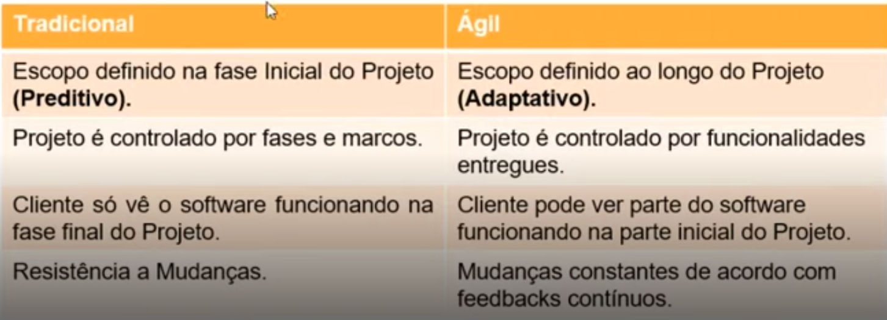

# SCRUM

- Conceitos Básicos
    
    SCRUM é um dos frameworks de **gerenciamento de projetos ágeis.**
    
    Projetos usando **equipes pequenas** e **multidisciplinates** produzem os **melhores resultados.**
    
    - Principio de Pareto
    
    Gestão de Projetos **Tradicional X Ágil**
    
    
    
    
    
    - Pilares do Scrum
        
        Transparência - Adaptação - Inspiração
        
- Papéis e Responsabilidades
    - Product Owner (PO)
        
        → Representante da área de Negócios;
        
        → PO não é um Comitê;
        
        → Define as funcionalidades do Software (Product Backlog);
        
        → Prioriza as funcionalidades de acordo com o valor do negócio;
        
        → Garante que o time de desenvolvimento entenda os itens do Backlog no nível necessário;
        
    - Scrum Master (SM)
        
        → Garantir o uso correto do SCRUM;
        
        → Scrum Master não é gerente de Projetos;
        
        → Age como falicitador;
        
        → Auxilia o PO no planejamento e estimativas do backlog;
        
        → Auxilia a equipe a remover impedimentos;
        
        → Treina o time em autogerenciamento e interdisciplinaridade;
        
    
    - Time de Desenvolvimento (DEV)
        
        → Possui habilidades suficientes para desenvolver, testar, criar e desenhar, ou seja, tudo que for necessário para entregar o software funcionando
        
- Cerimônias do Scrum
    
    Time Box: Tempo máximo para fazer uma cerimônia ou Sprint
    
    Sprint: Corrida, Arrancada.
    
    - Composição de uma Sprint:
        - Planejamento da Sprint
        - Reuniões Diárias ( Daily Meeting)
        - Revisão da Sprint (Review)
        - Retrospectiva da Sprint

---

Fundamentos de um Projeto Ágil

- Papéis e Responsabilidades - PO
    
    PO - Representa o profissional que tem a visão do que será desenvolvido, as necessidades a serem atendidas, o público que vai utilizar os serviços e os objetivos a serem alcançados.
    
    → Refining e Planning
    
    → Release Plannig
    
    Liberação ou lançamento de Software (Release) - É o lançamento de uma nova versão oficial de produto de software. Cada vez que um produto de software é criado ou modificadom o fabricante e seus desenvolvedores decidem sobre como distribuir ou o novo produto ou a modificação às pessoas que utilizam.
    
    Realese Planning de Múltiplas Squads
    
    Release Planning de Projeto
    
- Analisando escopo e definindo prioridades
    
    → Product Backlog: Composto por Épicos e Estórias
    
    → **Épicos:** Incremento sem muito detalhamento, ajuda a te direcionar dos caminhos que deve seguir.
    
    → **Estórias:** Detalhamento dos Épicos, um épico normalmente se divide em várias estórias, onde ficam descritas o que deve acontecer e suas regras de negócio.
    
    → Escrevendo uma Estória:
    
    - Nome da Estória
    - Descrição da Estória -  Eu, Como, Quero, Quando
    - Regras de Negócio - Separar Regras de Front-Ende de Regras de Back-end
    - Tela - Link ou imagem das telas a serem devolvidas
    - KPI - Quais Objetivos/Valor a estória precisa atingir
    - Tagueamento - Como a estória será Tagueada para poder mensurar os KPI
    - Critérios de Aceite - Qual o passo a passo de todos os Caminhos Felizes possíveis a estória deve cumprir para que seja considerada aceita
    
    → Riscos:
    
    **Positivos:** - Muito Ignorado nos projetos, porém um dos fatores de maiores ganhos nos desenvolvimentos de sistemas.
    
    **Negativos:** Itens que podem afetar o prazo, custo ou escopo de um projeto de maneira que pode acabar inviabilizando-o
    
- Papel do PO na transformação digital
    
    **Transformação Digital:**  É em processo no qual as empresa fazem uso da tecnologia para melhorar o desempenho, aumentar o alcance e garantir resultados melhores. É uma mudança estrutural nas organizações dando um papel essencial para tecnologia.
    

---

Conceitos e Atividades essenciais para o sucesso de um projeto ágil

- Conceitos e Planejamento de Tarefas
    
    Épico
    
    Estória - Uma tarefa descrita em nível de negócio
    
    Tarefas - Um conjunto de atividades que o time de desenvolvimento deve desempenhar para entregar a estória
    
    → Critérios de Aceite: É uma lista de critérios que precisam ser alcançados para que a User Story atenda os requisitos do usuário e seja aceita pelo PO. Os critérios de aceitação tem o objetivo de: definir limites para as user sotires, Ajudar o P.O a detalhar em alto nível o que é necessário para entregar valor ao cliente.
    
    → Planning Poker: Atividade de mensuração do esforço e complexidade das tarefas ou estórias.
    
    → Stakeholder: É uma pessoa ou um grupo que legitima as ações de uma organização e que tem um papel direto ou indireto na gestão e resultados dessa mesma organização. Desta forma, um stakeholder pode ser afetado positivamente ou negativamente, dependendo das suas politicas e formas de atuação. Alguns exemplos de stakeholder de uma empresa podem ser os seus funcionarios, gestoresm gerentes, proprietarios, fornecedoresm concorrentes, ONGs, o Estaom credores, sindicatos e diversas outras pessoas ou empresas que estejam relacionadas com uma determinada ação ou projeto.
    
- Rotinas de um time ágil